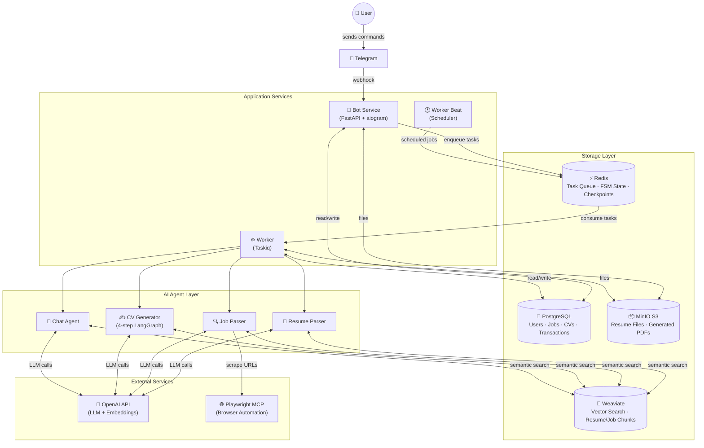
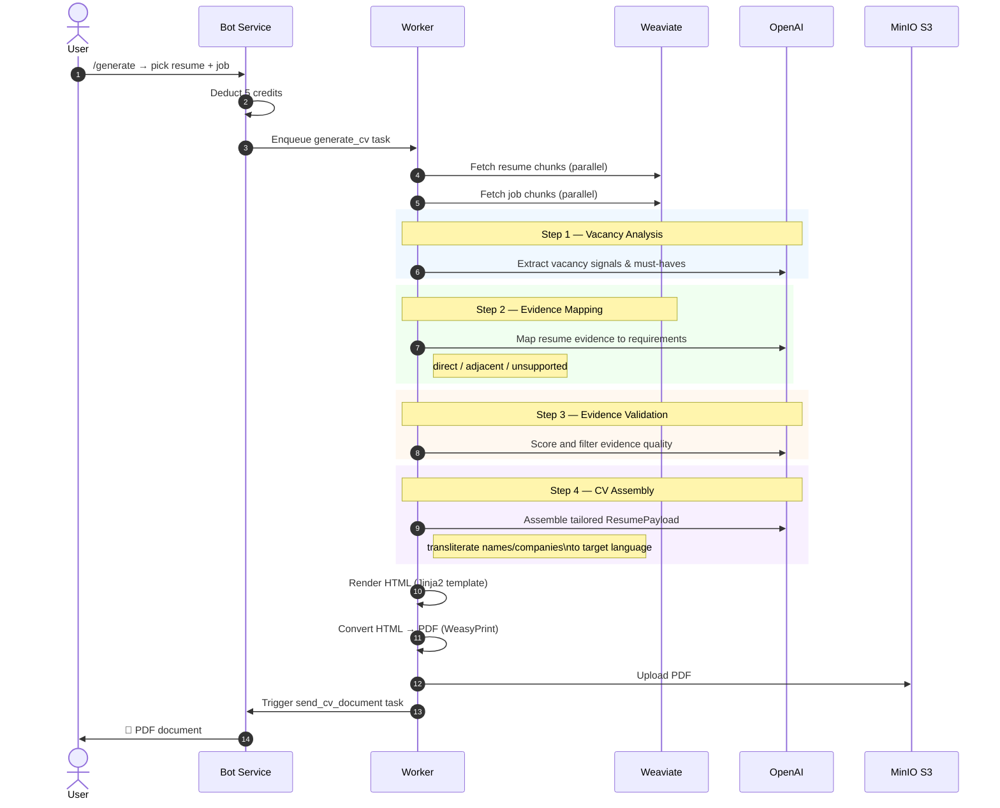
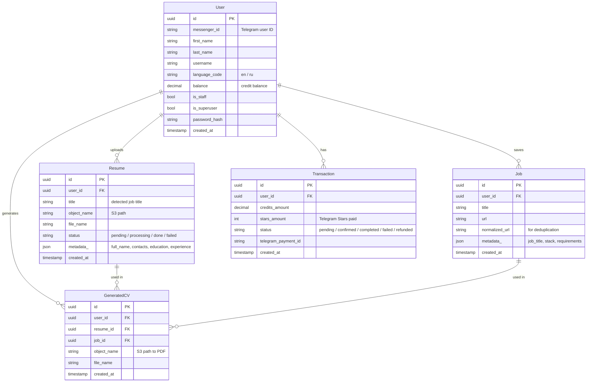
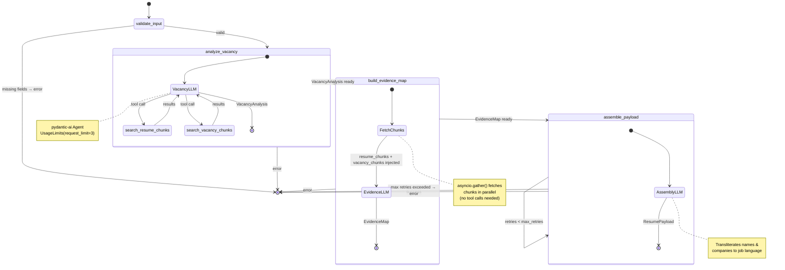
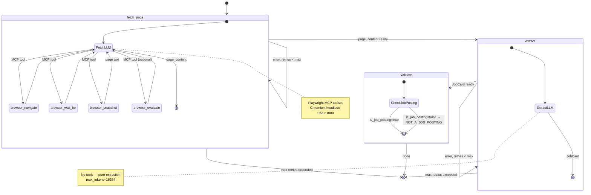
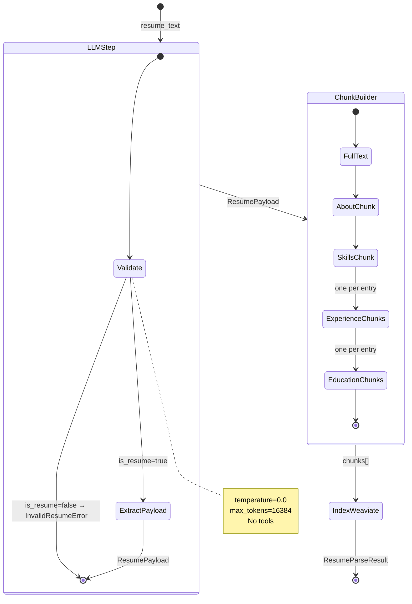
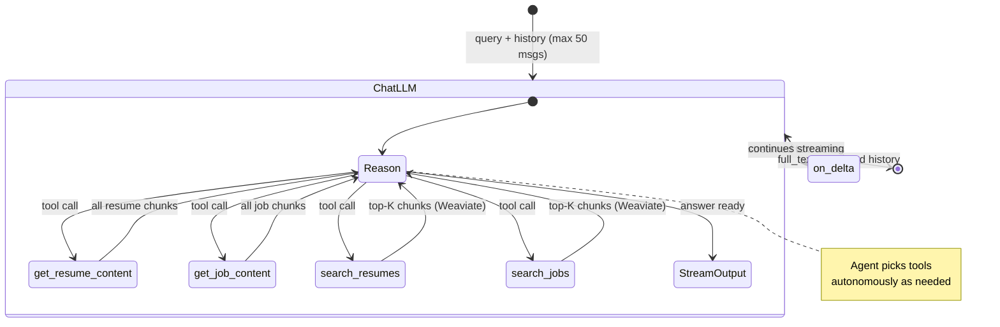

# CV Generator Bot — English Documentation

> A Telegram bot that tailors your resume to any job posting using AI.
> This is a course project. Source code: [github.com/swimmwatch/cv-generator](https://github.com/swimmwatch/cv-generator)

---

## Table of Contents

- [CV Generator Bot — English Documentation](#cv-generator-bot--english-documentation)
  - [Table of Contents](#table-of-contents)
  - [Overview](#overview)
  - [Features](#features)
  - [Architecture](#architecture)
    - [System Overview](#system-overview)
    - [CV Generation Pipeline](#cv-generation-pipeline)
    - [Data Model](#data-model)
  - [AI Agents](#ai-agents)
    - [Tools Reference](#tools-reference)
      - [MCP Tools (browser automation via Playwright)](#mcp-tools-browser-automation-via-playwright)
      - [Internal Tools (Python functions exposed to the agent)](#internal-tools-python-functions-exposed-to-the-agent)
    - [CV Generator Agent](#cv-generator-agent)
    - [Job Parser Agent](#job-parser-agent)
    - [Resume Parser Agent](#resume-parser-agent)
    - [Chat Agent](#chat-agent)
  - [Technology Stack](#technology-stack)
    - [Observability with Logfire](#observability-with-logfire)
  - [Getting Started](#getting-started)
    - [Prerequisites](#prerequisites)
    - [Configuration](#configuration)
    - [Running with Docker](#running-with-docker)
    - [Development Setup](#development-setup)
  - [How to Use](#how-to-use)
    - [Commands](#commands)
    - [Step-by-Step Workflow](#step-by-step-workflow)
    - [Credit System](#credit-system)
  - [Project Structure](#project-structure)

---

## Overview

**CV Generator Bot** is a Telegram bot that takes your uploaded resume and a job posting URL, then uses a multi-step AI agent pipeline to produce a tailored PDF resume matching the specific requirements of that vacancy.

The project was built as a course work assignment and demonstrates the integration of:
- LLM agents with multi-step reasoning (pydantic-ai + LangGraph)
- Vector semantic search (Weaviate)
- Async task processing (Taskiq)
- Telegram bot development (aiogram 3)
- Cloud storage, containerisation, and observability

---

## Features

| Feature | Description |
|---|---|
| **Resume upload** | Upload PDF or DOCX resumes; text is extracted and indexed in a vector database |
| **Job posting import** | Paste any job URL — the bot uses a headless browser to scrape and parse it |
| **AI CV generation** | A 4-step agentic workflow analyses the vacancy, maps your experience, and assembles a tailored resume |
| **PDF output** | Generated CVs are rendered from HTML templates and delivered as PDF |
| **Interactive chat** | Ask questions about your resume or job postings in a conversational interface |
| **Credit system** | Each action costs credits; new users receive 50 free credits |
| **Top-up via Telegram Stars** | Buy credit packs directly inside Telegram using the built-in payment system |
| **Multi-language UI** | Bot messages are available in English and Russian |

---

## Architecture

### System Overview



The system is split into three horizontally independent services:

- **Bot Service** — handles Telegram webhooks via FastAPI, manages FSM state for multi-step conversations, validates user input, deducts credits, and enqueues async tasks to Redis.
- **Worker** — a Taskiq consumer that runs CPU/IO-heavy work: text extraction, LLM agent calls, PDF rendering, and S3 uploads.
- **Worker Beat** — a scheduler that runs recurring tasks (heartbeat, maintenance).

All services share the same PostgreSQL database, Redis instance, MinIO, and Weaviate cluster.

---

### CV Generation Pipeline

The most complex part of the system — a 4-step LangGraph workflow triggered when a user requests CV generation:



**Key design decisions:**
- Evidence mapping runs in a single LLM call with pre-fetched chunk context (no iterative tool calls)
- The agent only uses content from the user's actual resume — no fabrication
- Names, companies, and institutions are transliterated to the target language of the job posting
- The vacancy analysis agent is limited to 3 LLM requests (`UsageLimits(request_limit=3)`)

---

### Data Model



Resume and Job entities also produce **chunks** stored in Weaviate (vector DB) for semantic similarity search during CV generation. Each chunk belongs to a section (e.g. `experience`, `skills`, `education`, `requirements`, `stack`).

---

## AI Agents

The system relies on four LLM agents built with **pydantic-ai** and orchestrated (where needed) with **LangGraph**. Two agents use a stateful graph with explicit nodes and retry logic; two are simpler single-call wrappers. All agents talk to OpenAI and access the vector database (Weaviate) through typed repository calls.

### Tools Reference

Agents use two categories of tools:

#### MCP Tools (browser automation via Playwright)

Provided by the **Playwright MCP** sidecar container over HTTP streaming. Available only to the **Job Parser** agent.

| Tool | Description |
|---|---|
| `browser_navigate` | Navigate to a URL in the headless browser |
| `browser_wait_for` | Wait for a CSS selector or network idle |
| `browser_snapshot` | Capture the current page as structured accessibility tree (text) |
| `browser_click` | Click an element on the page |
| `browser_evaluate` | Run arbitrary JavaScript in the browser context |
| `browser_tabs` | List or switch between open browser tabs |
| `browser_close` | Close the current browser tab |

#### Internal Tools (Python functions exposed to the agent)

| Tool | Agent | Description |
|---|---|---|
| `search_resume_chunks` | CV Generator | Semantic similarity search over indexed resume sections (Weaviate) |
| `search_vacancy_chunks` | CV Generator | Semantic similarity search over indexed job posting sections (Weaviate) |
| `get_resume_content` | Chat | Retrieve all chunks of the selected resume |
| `get_job_content` | Chat | Retrieve all chunks of the selected job posting |
| `search_resumes` | Chat | Semantic search in the selected resume (Weaviate) |
| `search_jobs` | Chat | Semantic search in the selected job posting (Weaviate) |

---

### CV Generator Agent

The most complex agent. Implemented as a **LangGraph StateGraph** with four sequential nodes. It uses three separate pydantic-ai sub-agents internally, each responsible for one reasoning step.

**Input state fields:** `user_id`, `metadata` (name, contacts, education, experience), `job_text`, `job_title`, `job_id`, `resume_id`, `template_json`  
**Output:** `CvGeneratorResult(success, result: ResumePayload)`



**Evidence classification** — each resume experience is labeled as:
- `direct` — clearly matches the requirement
- `adjacent` — related, transferable skill
- `unsupported` — no matching evidence → omitted from CV

---

### Job Parser Agent

A **LangGraph StateGraph** with three nodes. Uses the **Playwright MCP** toolset to open the job posting URL in a headless browser and extract its content, then a second LLM call structures the result.

**Input:** `job_reference` (URL)  
**Output:** `JobParserResult(success, result: JobCard, error)`



**JobCard output fields:** `is_job_posting`, `language_code`, `job_title`, `company_name`, `employment_type`, `location`, `seniority_level`, `required_skills`, `nice_to_have_skills`, `responsibilities`, `requirements`, `conditions`, `summary`, `text`

---

### Resume Parser Agent

A **simple single-call pydantic-ai agent** — no LangGraph graph, no tools. It receives the raw text of a resume (already extracted from PDF/DOCX by the worker), validates it is actually a resume, then parses it into a structured payload and produces chunks for Weaviate indexing.

**Input:** `resume_text`, `resume_id`, `user_id`  
**Output:** `ResumeParseResult(title, chunks, metadata)`



**Chunk sections produced:** `full_text`, `about`, `skills`, `experience` (×N), `education` (×N)

---

### Chat Agent

A **streaming single-call pydantic-ai agent** with a 4-function toolset. The agent autonomously decides which tools to call based on the user's question. Message history (up to 50 messages) is maintained in the bot handler and passed on each call — there is no persistent graph state.

**Input:** `query`, `user_id`, `resume_id`, `job_id`, `message_history`  
**Output:** streamed text + updated `message_history`



**Tool calls behaviour:** `get_*` tools return all chunks for full context; `search_*` tools run a Weaviate vector query and return the top-5 most relevant chunks. The agent may call multiple tools in a single response turn.

---

## Technology Stack

| Category | Library / Service | Version |
|---|---|---|
| **Language** | Python | 3.13+ |
| **Bot framework** | aiogram | 3.22.0 |
| **Web framework** | FastAPI | 0.129.1 |
| **LLM agents** | pydantic-ai | 1.62.0 |
| **Agent orchestration** | LangGraph | 1.0.9 |
| **LLM provider** | OpenAI API | — |
| **ORM** | SQLAlchemy (async) | 2.0.46 |
| **Migrations** | Alembic | 1.18.4 |
| **Task queue** | Taskiq | 0.12.1 |
| **Cache / Queue broker** | Redis | 8.4.0 |
| **Vector database** | Weaviate | 1.36.5 (client 4.20.3) |
| **Object storage** | MinIO (S3-compatible) | — |
| **PostgreSQL driver** | asyncpg | 0.31.0 |
| **PDF parsing** | PyMuPDF | 1.25.0 |
| **DOCX parsing** | python-docx | 1.1.0 |
| **PDF rendering** | WeasyPrint | 68.1 |
| **HTML templating** | Jinja2 | 3.1.6 |
| **Localisation** | Babel | 2.18.0 |
| **Browser automation** | Playwright (via MCP) | — |
| **Dependency injection** | dependency-injector | 4.48.3 |
| **Structured logging** | structlog + Logfire | 25.5.0 / 4.25.0 |
| **Type checking** | mypy | 1.19.1 |
| **Testing** | pytest + pytest-asyncio | 9.0.2 / 1.3.0 |

### Observability with Logfire

[Logfire](https://logfire.pydantic.dev) is Pydantic's structured observability platform. It is integrated at the framework level, meaning **no manual instrumentation is required** in application code — traces are emitted automatically.

What is captured out of the box:

| Source | What is traced |
|---|---|
| **pydantic-ai agents** | Every agent run, each LLM request/response, tool calls with arguments and results, token usage per step |
| **LangGraph** | Each graph node execution, state transitions, retry attempts |
| **SQLAlchemy** | All SQL queries with parameters and execution time |
| **httpx** | Outgoing HTTP requests (MCP, OpenAI, S3, Weaviate) with latency and status |
| **asyncio tasks** | Taskiq job execution spans |

Logfire sends structured spans to the Pydantic Logfire cloud dashboard, where you can:
- View the full trace of a CV generation request end-to-end (bot → worker → agents → OpenAI)
- Inspect exactly how many tokens each agent step consumed
- See which tool calls the agent made and how long each took
- Drill into SQL queries triggered by a single user action

To enable, set `LOGFIRE_TOKEN` in your `.env` file. If the token is absent, Logfire silently disables itself — no code changes needed.

---

## Getting Started

### Prerequisites

- Docker & Docker Compose
- An OpenAI API key
- A Telegram bot token (from [@BotFather](https://t.me/BotFather))
- A public webhook URL (e.g. via ngrok for local development)

### Configuration

1. Clone the repository:
   ```bash
   git clone https://github.com/swimmwatch/cv-generator.git
   cd cv-generator
   ```

2. Copy environment files and fill in the required values:
   ```bash
   cp .env.example .env
   cp .env.local.example .env.local
   ```

   Key variables to set:

   | Variable | Description |
   |---|---|
   | `OPENAI_API_KEY` | Your OpenAI API key |
   | `TG_BOT_TOKEN` | Telegram bot token |
   | `TG_WEBHOOK_URL` | Public URL for Telegram webhook |
   | `PROFILE` | `main` (production) or `development` |
   | `DB_*` | PostgreSQL connection settings |
   | `CACHE_*` | Redis connection settings |
   | `S3_*` | MinIO/S3 connection settings |
   | `WEAVIATE_*` | Weaviate connection settings |
   | `AGENTS_*_MODEL_NAME` | OpenAI model name per agent |

   The `PROFILE` variable selects the active Docker Compose profile:
   - `main` — full stack (bot + worker + all infrastructure)
   - `development` — infrastructure only (run bot/worker locally)

### Running with Docker

Start all services with a single command:

```bash
make up
```

Apply database migrations:

```bash
make migrate
```

Create a superuser (optional, for admin access):

```bash
uv run manage createsuperuser
```

### Development Setup

Install dependencies with [uv](https://github.com/astral-sh/uv):

```bash
uv venv
uv sync
```

Start only infrastructure services:

```bash
PROFILE=development make up
```

Run the bot locally:

```bash
uv run python -m apps.bot.main
```

Run the worker locally:

```bash
uv run python -m apps.worker.main
```

Run tests:

```bash
make test
```

Format and lint:

```bash
make format
make lint
```

---

## How to Use

### Commands

| Command | Description | Credits |
|---|---|---|
| `/start` | Show the welcome message and command list | Free |
| `/resume` | Upload a new resume (PDF or DOCX, max 10 MB) | **2 credits** |
| `/resumes` | List and manage your uploaded resumes | Free |
| `/job` | Add a job posting by URL | **2 credits** |
| `/jobs` | View your saved job postings | Free |
| `/generate` | Generate a tailored CV for a selected job | **5 credits** |
| `/cv` | Browse and download generated CVs | Free |
| `/chat` | Chat about your resume or a job posting | **1 credit/msg** |
| `/balance` | Check your current credit balance | Free |
| `/topup` | Buy more credits via Telegram Stars | — |

### Step-by-Step Workflow

```
1. Send /resume → upload your PDF or DOCX file
   ↓ Bot processes it asynchronously (chunks & indexes in Weaviate)

2. Send /job → paste a job posting URL
   ↓ Bot scrapes the page and extracts structured job data

3. Send /generate → pick your resume, then pick a job
   ↓ AI generates a tailored PDF resume (~30–60 seconds)

4. Receive the PDF in chat ✅
```

### Credit System

New users start with **50 free credits**.

| Action | Cost |
|---|---|
| Upload a resume | 2 credits |
| Add a job posting | 2 credits |
| Generate a tailored CV | 5 credits |
| Chat message | 1 credit |

**Credit packs** (purchased with Telegram Stars):

| Pack | Credits | Stars |
|---|---|---|
| Starter | 10 | ⭐ 10 |
| Small | 50 | ⭐ 50 |
| Medium | 100 | ⭐ 90 |
| Large | 500 | ⭐ 400 |

---

## Project Structure

```
cv-generator/
├── docker/                  # Dockerfiles for each service
│   ├── app/                 # Main app image
│   ├── mcp-proxy/           # MCP proxy server
│   └── playwright-mcp/      # Headless browser for job scraping
├── src/
│   ├── apps/
│   │   ├── bot/             # Telegram bot (aiogram + FastAPI webhook)
│   │   │   ├── handlers/    # One file per command (/start, /resume, /job, …)
│   │   │   ├── states/      # FSM state definitions
│   │   │   ├── filters.py   # Credit & status guards
│   │   │   └── tasks.py     # Taskiq tasks (send messages, notify)
│   │   └── worker/          # Taskiq consumer
│   │       └── tasks.py     # process_resume, parse_job, generate_cv, …
│   ├── cli/                 # Management commands (createsuperuser, weaviate_migrate)
│   ├── core/
│   │   ├── domains/         # Plain Python domain models & enums
│   │   ├── dto/             # Data Transfer Objects
│   │   ├── dal/             # Data Access Layer (SQLAlchemy queries)
│   │   ├── repos/           # Repository pattern (business-layer DB access)
│   │   ├── services/        # Business logic services
│   │   ├── models/          # SQLAlchemy ORM models
│   │   └── errors/          # Domain-specific exceptions
│   ├── infra/
│   │   ├── agents/          # LLM agent implementations
│   │   │   ├── cv_generator.py   # 4-step LangGraph CV generation
│   │   │   ├── job_parser.py     # Browser scrape + structured extraction
│   │   │   ├── resume_parser.py  # Resume parsing & chunking
│   │   │   └── chat.py           # Conversational chat agent
│   │   ├── db/              # SQLAlchemy engine, session factory
│   │   ├── redis/           # Redis client setup
│   │   ├── weaviate/        # Weaviate client & collection definitions
│   │   ├── s3/              # S3/MinIO async client
│   │   ├── di/              # Dependency injection container
│   │   ├── bot/
│   │   │   └── templates/   # Jinja2 HTML templates (CV layout, messages)
│   │   └── config.py        # Pydantic Settings (all env vars)
│   ├── locale/              # Babel i18n (en / ru)
│   ├── utils/               # Generic utilities (pagination, math, etc.)
│   └── tests/               # Shared fixtures & factories for tests
├── docker-compose.yml       # Production stack
├── docker-compose.dev.yml   # Development overrides
├── Makefile                 # Developer shortcuts
├── pyproject.toml           # Dependencies & tool configuration
└── alembic.ini              # Migration settings
```
