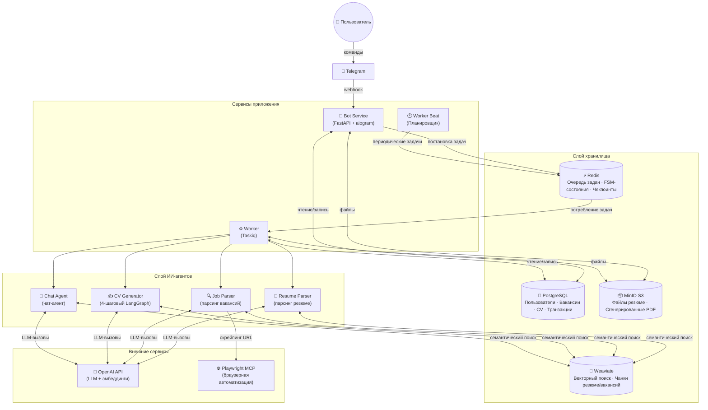
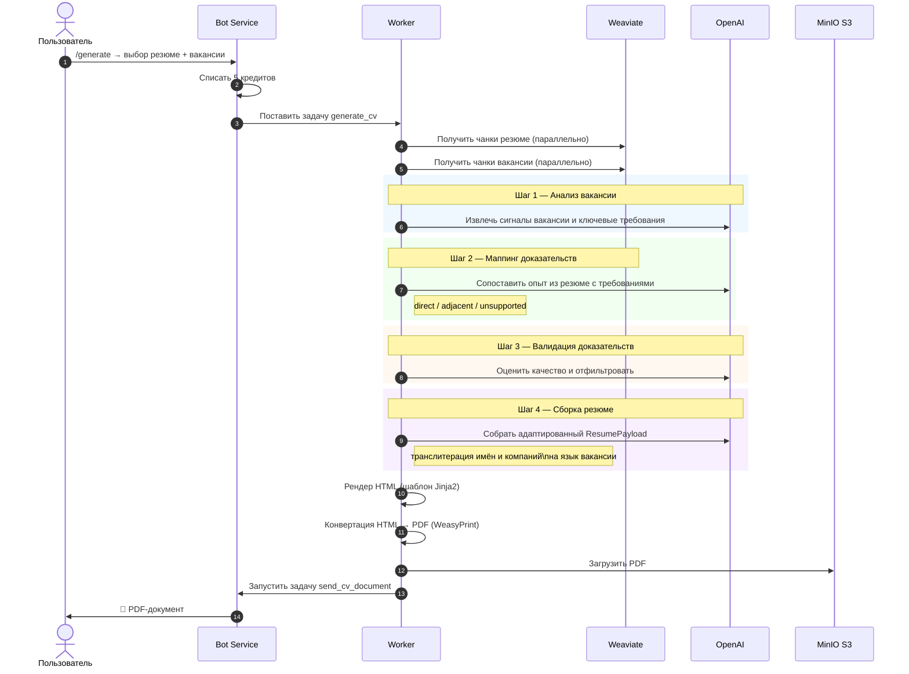
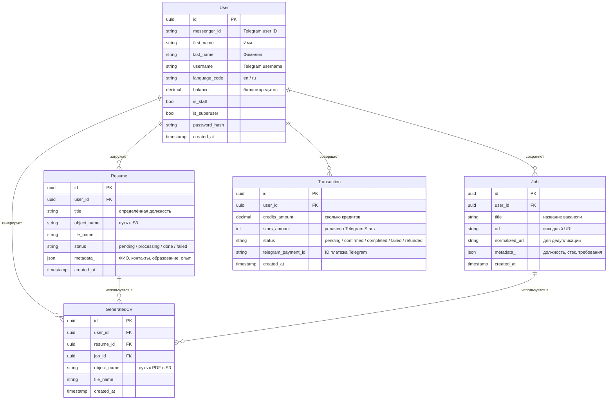
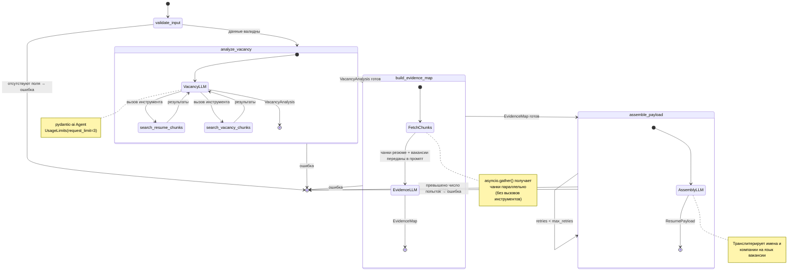
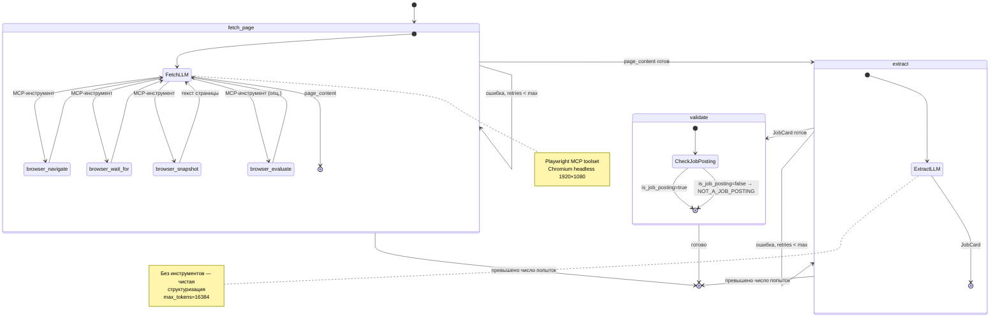
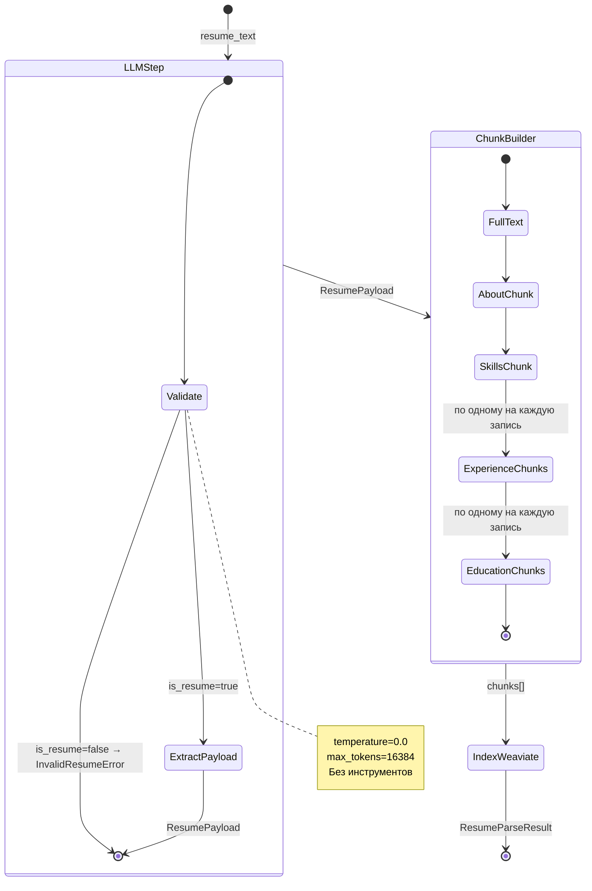
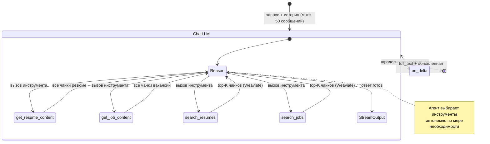

# CV Generator Bot — Документация на русском языке

> Telegram-бот, который адаптирует ваше резюме под конкретную вакансию с помощью ИИ.
> Это курсовой проект. Исходный код: [github.com/swimmwatch/cv-generator](https://github.com/swimmwatch/cv-generator)

---

## Содержание

- [CV Generator Bot — Документация на русском языке](#cv-generator-bot--документация-на-русском-языке)
  - [Содержание](#содержание)
  - [Обзор](#обзор)
  - [Возможности](#возможности)
  - [Архитектура](#архитектура)
    - [Общая схема системы](#общая-схема-системы)
    - [Пайплайн генерации резюме](#пайплайн-генерации-резюме)
    - [Модель данных](#модель-данных)
  - [ИИ-агенты](#ии-агенты)
    - [Справочник инструментов](#справочник-инструментов)
      - [MCP-инструменты (браузерная автоматизация через Playwright)](#mcp-инструменты-браузерная-автоматизация-через-playwright)
      - [Внутренние инструменты (Python-функции, доступные агенту)](#внутренние-инструменты-python-функции-доступные-агенту)
    - [Агент генерации CV](#агент-генерации-cv)
    - [Агент парсинга вакансий](#агент-парсинга-вакансий)
    - [Агент парсинга резюме](#агент-парсинга-резюме)
    - [Чат-агент](#чат-агент)
  - [Технологический стек](#технологический-стек)
    - [Наблюдаемость с Logfire](#наблюдаемость-с-logfire)
  - [Начало работы](#начало-работы)
    - [Требования](#требования)
    - [Конфигурация](#конфигурация)
    - [Запуск через Docker](#запуск-через-docker)
    - [Настройка для разработки](#настройка-для-разработки)
  - [Как пользоваться](#как-пользоваться)
    - [Команды бота](#команды-бота)
    - [Пошаговый воркфлоу](#пошаговый-воркфлоу)
    - [Система кредитов](#система-кредитов)
  - [Структура проекта](#структура-проекта)

---

## Обзор

**CV Generator Bot** — это Telegram-бот, который принимает ваше резюме и ссылку на вакансию, а затем с помощью многошагового конвейера ИИ-агентов создаёт адаптированное PDF-резюме, максимально соответствующее требованиям выбранной вакансии.

Проект выполнен как курсовая работа и демонстрирует интеграцию:
- LLM-агентов с многошаговым рассуждением (pydantic-ai + LangGraph)
- Векторного семантического поиска (Weaviate)
- Асинхронной обработки задач (Taskiq)
- Разработки Telegram-ботов (aiogram 3)
- Облачного хранилища, контейнеризации и наблюдаемости системы

---

## Возможности

| Функция | Описание |
|---|---|
| **Загрузка резюме** | Загрузите PDF или DOCX — текст извлекается и индексируется в векторной БД |
| **Импорт вакансий** | Вставьте ссылку на вакансию — бот открывает страницу через браузер и парсит содержимое |
| **ИИ-генерация CV** | Четырёхшаговый агентный воркфлоу анализирует вакансию, подбирает релевантный опыт и собирает резюме |
| **Вывод в PDF** | Сгенерированные CV рендерятся из HTML-шаблона и отправляются как PDF-файл |
| **Интерактивный чат** | Задавайте вопросы о своём резюме или вакансии в диалоговом режиме |
| **Система кредитов** | Каждое действие стоит кредиты; новые пользователи получают 50 бесплатных кредитов |
| **Пополнение через Telegram Stars** | Покупка кредитов прямо внутри Telegram с помощью встроенной платёжной системы |
| **Мультиязычный интерфейс** | Сообщения бота доступны на английском и русском языке |

---

## Архитектура

### Общая схема системы



Система разделена на три независимо масштабируемых сервиса:

- **Bot Service** — обрабатывает Telegram-вебхуки через FastAPI, управляет FSM-состояниями многошаговых разговоров, валидирует ввод пользователя, списывает кредиты и ставит асинхронные задачи в Redis.
- **Worker** — Taskiq-потребитель, выполняющий тяжёлые CPU/IO-операции: извлечение текста, вызовы LLM-агентов, рендеринг PDF и загрузка в S3.
- **Worker Beat** — планировщик периодических задач (хартбит, обслуживание).

Все сервисы разделяют одну базу данных PostgreSQL, Redis, MinIO и кластер Weaviate.

---

### Пайплайн генерации резюме

Наиболее сложная часть системы — четырёхшаговый воркфлоу LangGraph, запускаемый при запросе генерации CV:



**Ключевые архитектурные решения:**
- Маппинг доказательств выполняется в одном LLM-вызове с заранее загруженным контекстом чанков (без итеративных tool calls)
- Агент использует только содержимое настоящего резюме пользователя — никакой «галлюцинации» фактов
- Имена, компании и учреждения транслитерируются на язык вакансии
- Агент анализа вакансии ограничен 3 LLM-запросами (`UsageLimits(request_limit=3)`)

---

### Модель данных



Сущности Resume и Job также порождают **чанки** (фрагменты текста), хранящиеся в Weaviate для семантического поиска при генерации CV. Каждый чанк относится к определённой секции: `experience`, `skills`, `education`, `requirements`, `stack` и т. д.

---

## ИИ-агенты

Система использует четыре LLM-агента, построенных на **pydantic-ai** и оркестрируемых (там, где необходимо) через **LangGraph**. Два агента используют граф состояний с явными узлами и повторными попытками; два — более простые обёртки с одним вызовом. Все агенты обращаются к OpenAI и к векторной базе данных (Weaviate) через типизированные репозитории.

### Справочник инструментов

Агенты используют два вида инструментов:

#### MCP-инструменты (браузерная автоматизация через Playwright)

Предоставляются sidecar-контейнером **Playwright MCP** по HTTP streaming. Доступны только агенту **Job Parser**.

| Инструмент | Описание |
|---|---|
| `browser_navigate` | Перейти по URL в headless-браузере |
| `browser_wait_for` | Ождать появления CSS-селектора или завершения сетевых запросов |
| `browser_snapshot` | Получить текстовое дерево доступности текущей страницы |
| `browser_click` | Кликнуть по элементу на странице |
| `browser_evaluate` | Выполнить произвольный JavaScript в контексте браузера |
| `browser_tabs` | Получить список вкладок или переключиться между ними |
| `browser_close` | Закрыть текущую вкладку браузера |

#### Внутренние инструменты (Python-функции, доступные агенту)

| Инструмент | Агент | Описание |
|---|---|---|
| `search_resume_chunks` | CV Generator | Семантический поиск по проиндексированным секциям резюме (Weaviate) |
| `search_vacancy_chunks` | CV Generator | Семантический поиск по проиндексированным секциям вакансии (Weaviate) |
| `get_resume_content` | Chat | Получить все чанки выбранного резюме |
| `get_job_content` | Chat | Получить все чанки выбранной вакансии |
| `search_resumes` | Chat | Семантический поиск в выбранном резюме (Weaviate) |
| `search_jobs` | Chat | Семантический поиск в выбранной вакансии (Weaviate) |

---

### Агент генерации CV

Наиболее сложный агент. Реализован как **LangGraph StateGraph** с четырьмя последовательными узлами. Внутри использует три отдельных pydantic-ai суб-агента, каждый из которых отвечает за один шаг рассуждения.

**Поля входного состояния:** `user_id`, `metadata` (имя, контакты, образование, опыт), `job_text`, `job_title`, `job_id`, `resume_id`, `template_json`  
**Выход:** `CvGeneratorResult(success, result: ResumePayload)`



**Классификация доказательств** — каждый опыт из резюме помечается:
- `direct` — явно соответствует требованию
- `adjacent` — смежный, переносимый навык
- `unsupported` — совпадений нет → исключается из CV

---

### Агент парсинга вакансий

**LangGraph StateGraph** с тремя узлами. Использует инструменты **Playwright MCP**, чтобы открыть URL вакансии в headless-браузере и извлечь содержимое, затем второй LLM-вызов структурирует результат.

**Вход:** `job_reference` (URL)  
**Выход:** `JobParserResult(success, result: JobCard, error)`



**Поля JobCard:** `is_job_posting`, `language_code`, `job_title`, `company_name`, `employment_type`, `location`, `seniority_level`, `required_skills`, `nice_to_have_skills`, `responsibilities`, `requirements`, `conditions`, `summary`, `text`

---

### Агент парсинга резюме

**Простой однократный pydantic-ai агент** — без графа LangGraph, без инструментов. Получает сырой текст резюме (уже извлечённый воркером из PDF/DOCX), проверяет, что это действительно резюме, затем парсит его в структурированный формат и создаёт чанки для индексации в Weaviate.

**Вход:** `resume_text`, `resume_id`, `user_id`  
**Выход:** `ResumeParseResult(title, chunks, metadata)`



**Создаваемые секции чанков:** `full_text`, `about`, `skills`, `experience` (×N), `education` (×N)

---

### Чат-агент

**Потоковый однократный pydantic-ai агент** с набором из 4 инструментов. Агент самостоятельно решает, какие инструменты вызвать, исходя из вопроса пользователя. История сообщений (до 50 сообщений) хранится в обработчике бота и передаётся при каждом вызове — постоянного состояния графа нет.

**Вход:** `query`, `user_id`, `resume_id`, `job_id`, `message_history`  
**Выход:** потоковый текст + обновлённая `message_history`



**Поведение инструментов:** `get_*` — возвращают все чанки для полного контекста; `search_*` — выполняют векторный запрос в Weaviate и возвращают топ-5 наиболее релевантных чанков. Агент может вызвать несколько инструментов в рамках одного ответа.

---

## Технологический стек

| Категория | Библиотека / Сервис | Версия |
|---|---|---|
| **Язык** | Python | 3.13+ |
| **Фреймворк бота** | aiogram | 3.22.0 |
| **Веб-фреймворк** | FastAPI | 0.129.1 |
| **LLM-агенты** | pydantic-ai | 1.62.0 |
| **Оркестрация агентов** | LangGraph | 1.0.9 |
| **Провайдер LLM** | OpenAI API | — |
| **ORM** | SQLAlchemy (async) | 2.0.46 |
| **Миграции** | Alembic | 1.18.4 |
| **Очередь задач** | Taskiq | 0.12.1 |
| **Кэш / Брокер** | Redis | 8.4.0 |
| **Векторная БД** | Weaviate | 1.36.5 (клиент 4.20.3) |
| **Объектное хранилище** | MinIO (S3-совместимое) | — |
| **Драйвер PostgreSQL** | asyncpg | 0.31.0 |
| **Парсинг PDF** | PyMuPDF | 1.25.0 |
| **Парсинг DOCX** | python-docx | 1.1.0 |
| **Рендеринг PDF** | WeasyPrint | 68.1 |
| **HTML-шаблоны** | Jinja2 | 3.1.6 |
| **Локализация** | Babel | 2.18.0 |
| **Браузерная автоматизация** | Playwright (через MCP) | — |
| **Внедрение зависимостей** | dependency-injector | 4.48.3 |
| **Структурированное логирование** | structlog + Logfire | 25.5.0 / 4.25.0 |
| **Проверка типов** | mypy | 1.19.1 |
| **Тестирование** | pytest + pytest-asyncio | 9.0.2 / 1.3.0 |

### Наблюдаемость с Logfire

[Logfire](https://logfire.pydantic.dev) — облачная платформа структурированной наблюдаемости от Pydantic. Интегрирована на уровне фреймворков, поэтому **ручной инструментации в коде приложения не требуется** — трейсы эмитируются автоматически.

Что фиксируется из коробки:

| Источник | Что трейсируется |
|---|---|
| **pydantic-ai агенты** | Каждый запуск агента, каждый LLM-запрос/ответ, вызовы инструментов с аргументами и результатами, потребление токенов на каждом шаге |
| **LangGraph** | Выполнение каждого узла графа, переходы между состояниями, повторные попытки |
| **SQLAlchemy** | Все SQL-запросы с параметрами и временем выполнения |
| **httpx** | Исходящие HTTP-запросы (MCP, OpenAI, S3, Weaviate) с задержкой и статусом |
| **asyncio-задачи** | Спаны выполнения Taskiq-задач |

Logfire отправляет структурированные спаны в облачный дашборд Pydantic Logfire, где можно:
- Просмотреть полный трейс запроса генерации CV от начала до конца (бот → воркер → агенты → OpenAI)
- Увидеть, сколько токенов потребил каждый шаг агента
- Посмотреть, какие инструменты вызывал агент и сколько времени каждый занял
- Детализировать SQL-запросы, порождённые одним действием пользователя

Для активации укажите `LOGFIRE_TOKEN` в файле `.env`. Если токен не задан, Logfire отключается автоматически — изменений в коде не требуется.

---

## Начало работы

### Требования

- Docker и Docker Compose
- Ключ OpenAI API
- Токен Telegram-бота (от [@BotFather](https://t.me/BotFather))
- Публичный URL для вебхука (например, через ngrok для локальной разработки)

### Конфигурация

1. Клонируйте репозиторий:
   ```bash
   git clone https://github.com/swimmwatch/cv-generator.git
   cd cv-generator
   ```

2. Скопируйте файлы окружения и заполните необходимые переменные:
   ```bash
   cp .env.example .env
   cp .env.local.example .env.local
   ```

   Ключевые переменные:

   | Переменная | Описание |
   |---|---|
   | `OPENAI_API_KEY` | Ключ OpenAI API |
   | `TG_BOT_TOKEN` | Токен Telegram-бота |
   | `TG_WEBHOOK_URL` | Публичный URL для вебхука |
   | `PROFILE` | `main` (продакшн) или `development` |
   | `DB_*` | Настройки подключения к PostgreSQL |
   | `CACHE_*` | Настройки подключения к Redis |
   | `S3_*` | Настройки подключения к MinIO/S3 |
   | `WEAVIATE_*` | Настройки подключения к Weaviate |
   | `AGENTS_*_MODEL_NAME` | Модель OpenAI для каждого агента |

   Переменная `PROFILE` выбирает активный профиль Docker Compose:
   - `main` — полный стек (бот + воркер + вся инфраструктура)
   - `development` — только инфраструктура (бот/воркер запускаются локально)

### Запуск через Docker

Запустите все сервисы одной командой:

```bash
make up
```

Примените миграции базы данных:

```bash
make migrate
```

Создайте суперпользователя (опционально, для доступа к административным функциям):

```bash
uv run manage createsuperuser
```

### Настройка для разработки

Установите зависимости с помощью [uv](https://github.com/astral-sh/uv):

```bash
uv venv
uv sync
```

Запустите только инфраструктурные сервисы:

```bash
PROFILE=development make up
```

Запустите бота локально:

```bash
uv run python -m apps.bot.main
```

Запустите воркер локально:

```bash
uv run python -m apps.worker.main
```

Запустите тесты:

```bash
make test
```

Форматирование и линтинг:

```bash
make format
make lint
```

---

## Как пользоваться

### Команды бота

| Команда | Описание | Стоимость |
|---|---|---|
| `/start` | Приветственное сообщение и список команд | Бесплатно |
| `/resume` | Загрузить новое резюме (PDF или DOCX, макс. 10 МБ) | **2 кредита** |
| `/resumes` | Список загруженных резюме и управление ими | Бесплатно |
| `/job` | Добавить вакансию по ссылке | **2 кредита** |
| `/jobs` | Просмотр сохранённых вакансий | Бесплатно |
| `/generate` | Сгенерировать адаптированное CV под выбранную вакансию | **5 кредитов** |
| `/cv` | Просмотр и скачивание сгенерированных CV | Бесплатно |
| `/chat` | Чат о своём резюме или вакансии | **1 кредит/соо.** |
| `/balance` | Проверить текущий баланс кредитов | Бесплатно |
| `/topup` | Купить кредиты через Telegram Stars | — |

### Пошаговый воркфлоу

```
1. Отправьте /resume → загрузите PDF или DOCX файл
   ↓ Бот обрабатывает файл асинхронно (разбивает на чанки и индексирует в Weaviate)

2. Отправьте /job → вставьте ссылку на вакансию
   ↓ Бот открывает страницу через браузер и извлекает структурированные данные о вакансии

3. Отправьте /generate → выберите резюме, затем вакансию
   ↓ ИИ генерирует адаптированное PDF-резюме (~30–60 секунд)

4. Получите PDF прямо в чате ✅
```

### Система кредитов

Новые пользователи получают **50 бесплатных кредитов**.

| Действие | Стоимость |
|---|---|
| Загрузка резюме | 2 кредита |
| Добавление вакансии | 2 кредита |
| Генерация CV | 5 кредитов |
| Сообщение в чате | 1 кредит |

**Пакеты кредитов** (покупка через Telegram Stars):

| Пакет | Кредиты | Stars |
|---|---|---|
| Starter | 10 | ⭐ 10 |
| Small | 50 | ⭐ 50 |
| Medium | 100 | ⭐ 90 |
| Large | 500 | ⭐ 400 |

---

## Структура проекта

```
cv-generator/
├── docker/                  # Dockerfile для каждого сервиса
│   ├── app/                 # Образ основного приложения
│   ├── mcp-proxy/           # MCP-прокси сервер
│   └── playwright-mcp/      # Headless-браузер для парсинга
├── src/
│   ├── apps/
│   │   ├── bot/             # Telegram-бот (aiogram + FastAPI webhook)
│   │   │   ├── handlers/    # По одному файлу на команду (/start, /resume, /job, …)
│   │   │   ├── states/      # Определения FSM-состояний
│   │   │   ├── filters.py   # Фильтры (кредиты, статус резюме)
│   │   │   └── tasks.py     # Taskiq-задачи (отправка сообщений, уведомлений)
│   │   └── worker/          # Taskiq-консьюмер
│   │       └── tasks.py     # process_resume, parse_job, generate_cv, …
│   ├── cli/                 # Управляющие команды (createsuperuser, weaviate_migrate)
│   ├── core/
│   │   ├── domains/         # Чистые доменные модели и перечисления Python
│   │   ├── dto/             # Data Transfer Objects
│   │   ├── dal/             # Data Access Layer (запросы SQLAlchemy)
│   │   ├── repos/           # Паттерн Repository (бизнес-уровень доступа к БД)
│   │   ├── services/        # Бизнес-логика
│   │   ├── models/          # ORM-модели SQLAlchemy
│   │   └── errors/          # Доменные исключения
│   ├── infra/
│   │   ├── agents/          # Реализации LLM-агентов
│   │   │   ├── cv_generator.py   # 4-шаговая генерация CV (LangGraph)
│   │   │   ├── job_parser.py     # Парсинг вакансий (браузер + структуризация)
│   │   │   ├── resume_parser.py  # Парсинг и разбивка резюме на чанки
│   │   │   └── chat.py           # Диалоговый чат-агент
│   │   ├── db/              # SQLAlchemy engine, фабрика сессий
│   │   ├── redis/           # Настройка Redis-клиента
│   │   ├── weaviate/        # Клиент Weaviate и определения коллекций
│   │   ├── s3/              # Асинхронный клиент S3/MinIO
│   │   ├── di/              # Контейнер внедрения зависимостей
│   │   ├── bot/
│   │   │   └── templates/   # Jinja2 HTML-шаблоны (вёрстка CV, сообщения)
│   │   └── config.py        # Pydantic Settings (все переменные окружения)
│   ├── locale/              # Babel i18n (en / ru)
│   ├── utils/               # Общие утилиты (пагинация, математика и т. д.)
│   └── tests/               # Общие фикстуры и фабрики для тестов
├── docker-compose.yml       # Продакшн-стек
├── docker-compose.dev.yml   # Оверрайды для разработки
├── Makefile                 # Удобные команды для разработчика
├── pyproject.toml           # Зависимости и конфигурация инструментов
└── alembic.ini              # Настройки миграций
```
